### 虚拟机优点

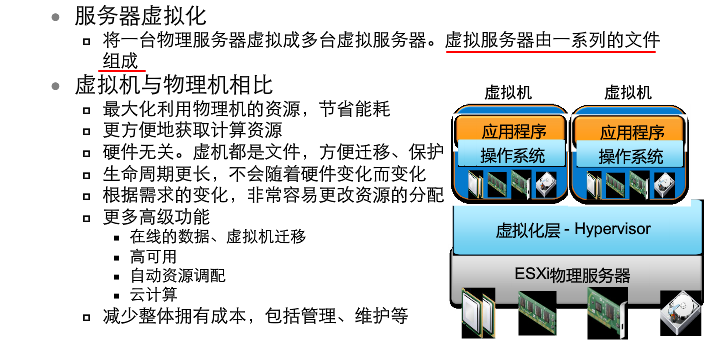

### 基本架构

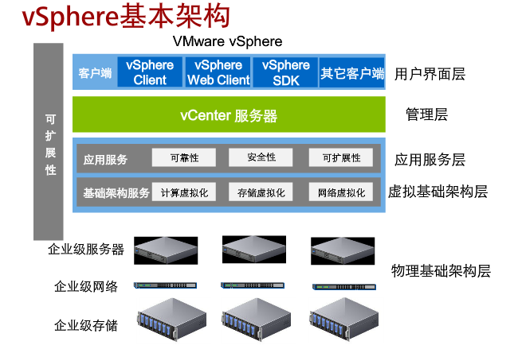

### vmkernel

- 负责CPU资源调度
- 分时
- 控制内存虚拟化
  - vnkernel控制物理内存
  - 每个VM拥有独立的连续可寻址的虚拟内存空间
  - 优化内存使用
  - 物理内存不足时可以使用磁盘存储作为交换空间

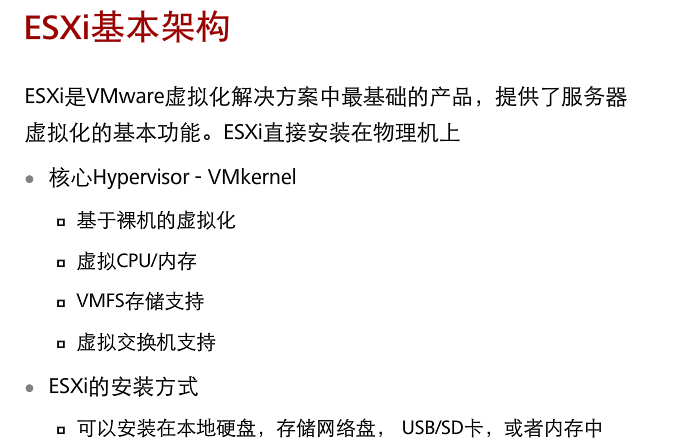

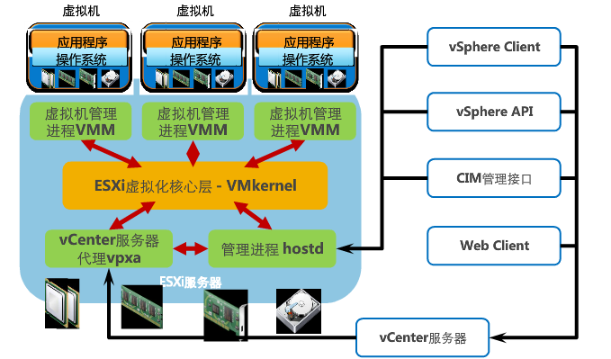

### vCenter  server


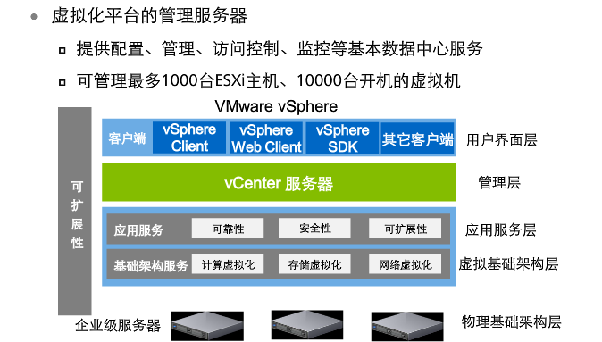

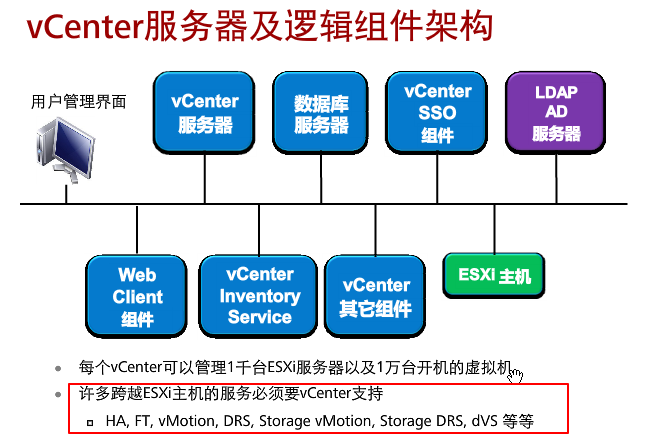

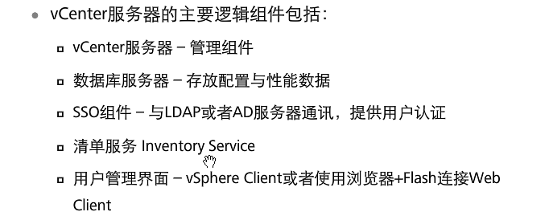

### 虚拟机文件

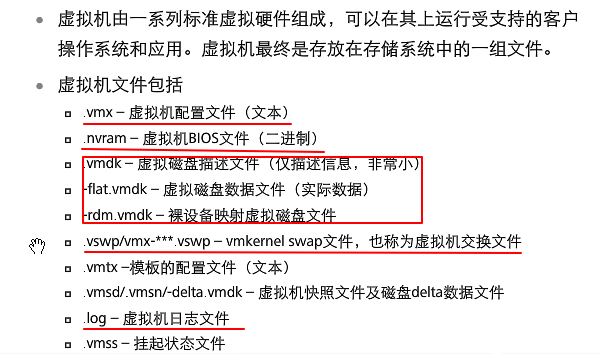

### 虚拟机模板

- 模板

  > 模板  = 客户操作系统 + 一组应用程序 + 特定虚拟机配置镜像

  - 虚拟机转换为模板

    ```
    为虚拟机添加模板标记并转换为模板，效率快
    虚拟机必须处于关闭状态
    ```

  - 虚拟机克隆为模板

    ```
    先克隆虚拟机再转换为模板，耗时长
    虚拟机可开启也可关闭
    ```

    通过模板部署虚拟机

    转换为虚拟机来修改模板

- 克隆虚拟机

  ```
  克隆是虚拟机的一个精确副本

  被克隆的虚拟机可以关机也可以开机
  ```

### 虚拟机迁移

- 迁移方式

  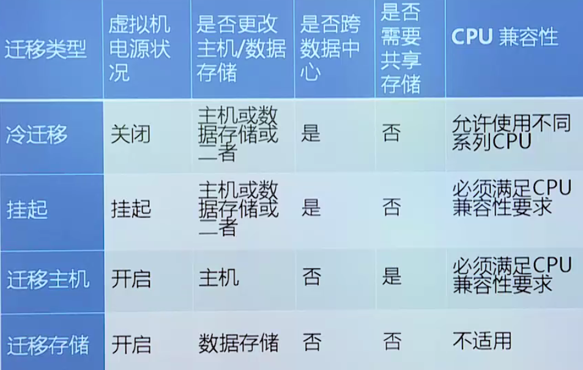

- 迁移主机vMotion

  ```
  通过vMotion可以实现虚拟机的动态迁移，而服务不中断
  ```

  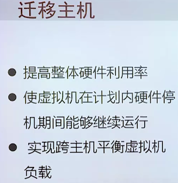

- Storage vMotion

  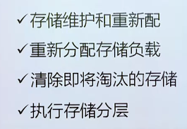

### HA:高可用集群

```
在同一时刻只有一台机器处于活动状态，另一台处于备份状态
```

