## 存储基础原理

#### 存储与应用环境

- 软件资源
- 计算资源
- 网络资源
- 存储资源

#### 信息数据管理

##### 数据分类

- 结构化数据

  ```
  存储在数据库里，可以用二维表结构逻辑表达实现的数据，直接可用
  举例：数据库、电子表格中存储的数据
  ```

- 非结构化数据

  ```
  不方便用数据库二维逻辑表来表现的数据
  从非结构化数据上无法看到数据本身代表的含义，无法直接获取数据中的信息
  举例：文档、图片、网页、视频等
  ```

  ​

#### 网络附加存储NAS简介

##### 什么是NAS？

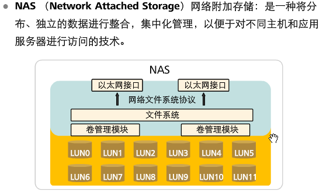

- 存储系统的演进

  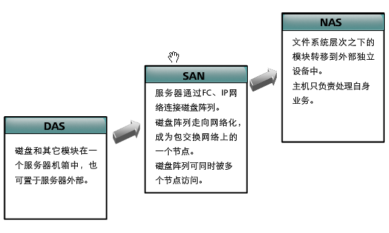

- 集群NAS

  - 集群技术

  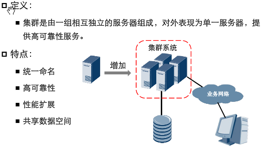

  - 集群NAS优点

  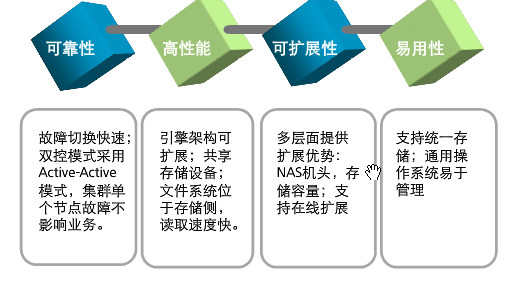

- NAS与FTP

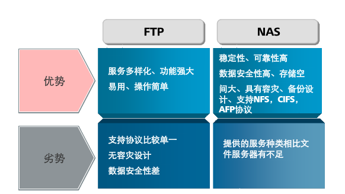


##### NAS系统组成

- 系统架构

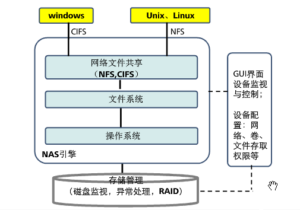


- 系统组成

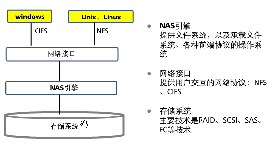

##### 文件共享协议

- CIFS

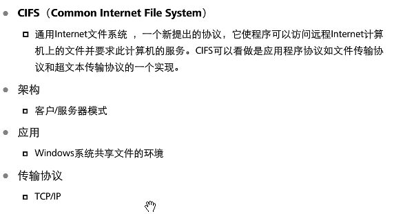

- NFS

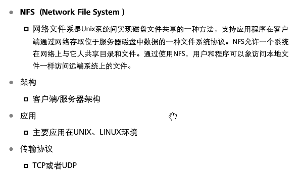

- NFS和CIFS对比

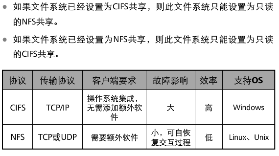

##### NAS文件系统IO与性能

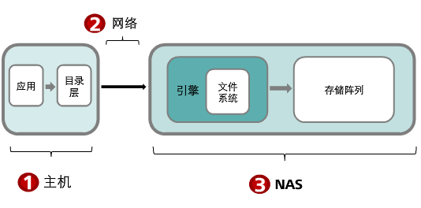

- 主机侧

  

- 网络

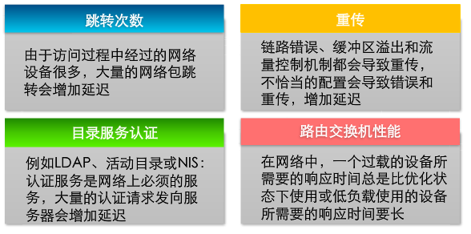

- 设备侧

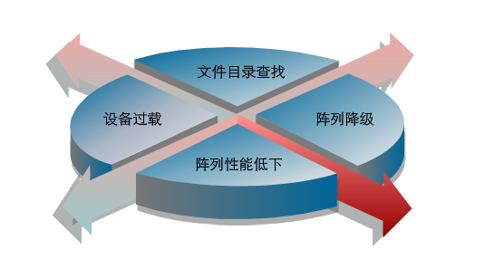

##### NAS与SAN比较

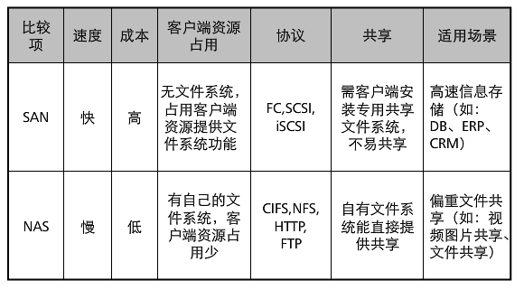

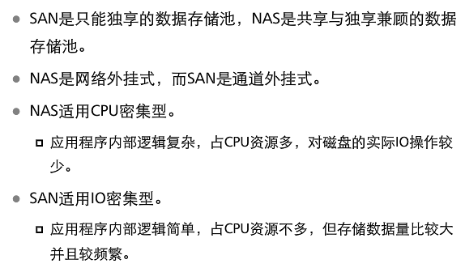

#### SAN技术与应用

##### 存储网络类型

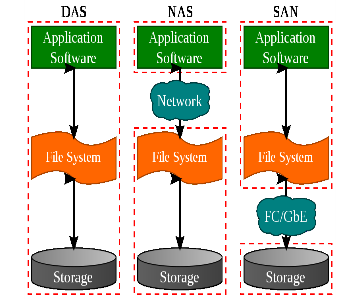

> DAS结构与缺点

- 结构

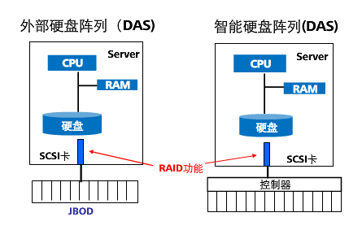

- 缺点

