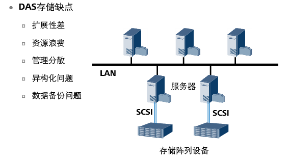
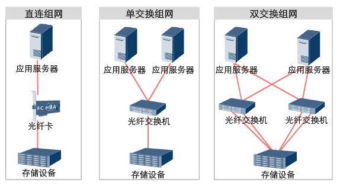
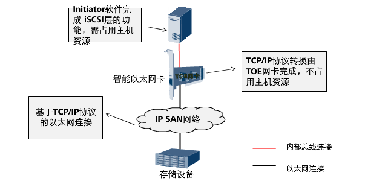

## 存储基础原理

#### 存储与应用环境

- 软件资源
- 计算资源
- 网络资源
- 存储资源

#### 信息数据管理

##### 数据分类

- 结构化数据

  ```
  存储在数据库里，可以用二维表结构逻辑表达实现的数据，直接可用
  举例：数据库、电子表格中存储的数据
  ```

- 非结构化数据

  ```
  不方便用数据库二维逻辑表来表现的数据
  从非结构化数据上无法看到数据本身代表的含义，无法直接获取数据中的信息
  举例：文档、图片、网页、视频等
  ```

  ​

#### 网络附加存储NAS简介

##### 什么是NAS？


- 存储系统的演进

  

- 集群NAS

  - 集群技术

  

  - 集群NAS优点

  

- NAS与FTP


##### NAS系统组成

- 系统架构


- 系统组成


##### 文件共享协议

- CIFS


- NFS


- NFS和CIFS对比


##### NAS文件系统IO与性能


- 主机侧

  

- 网络


- 设备侧


##### NAS与SAN比较


#### SAN技术与应用

##### 存储网络类型


> DAS概述

- 结构


- 缺点



- 优点


- DAS连接协议


##### SAN存储基本结构

- 定义


```
存储区域网络(Storage Area Networks，SAN)：是一个用在服务器和存储资源之间的、专用的、高性能的网络体系。它为了实现大量原始数据的传输而进行了专门的优化。因此，可以把SAN看成是对SCSI协议在长距离应用上的扩展。SAN使用的典型协议组是SCSI和Fiber Channel 。
```

- 组网



```
在一个SAN解决方案中，可以使用铜缆或者光纤缆线，将SAN组件彼此连接起来。
```

- SAN组件


- SAN架构常用协议

  - FC 协议 (Fibre Channel) ，使用该种协议的SAN架构，称为FC SAN
  - iSCSI 协议 (Internet SCSI)，使用该种协议的SAN架构，称为IP SAN。
  - FCoE 协议(Fibre Channel over Ethernet)

  ```
  FC 协议通常和iSCSI协议用于现代的SAN架构中，而FCoE协议在服务器需要融合SAN和LAN业务时，也是用得越来越多
  ```


- 存储特点


- SAN与DAS区别


##### FC-SAN存储

- FC协议

  > 简介

  

  > FC拓扑结构

  

  > 协议栈

  

  > FC与SCSI协议关系

  - FC通道并不是SCSI的替代，FC可以通过构建帧来传输SCSI的指令、数据和状态信息单元。
  - SCSI是位于光纤通道协议栈FC-4的上层协议，SCSI是FC协议的子集。

- FC-SAN系统组成

  - 存储设备

    

  - 光纤交换机

    

    - Zone

      ```
      可进行互通的端口或设备的名称构成的集合
      在一个zone中的设备只能与同一个zone中其他设备进行通信
      一个设备可以同时在多个zone中
      ```

    - 端口

  - 光模块

    

    

  - FC HBA卡

    

    > HBA卡的WWN

    


##### IP-SAN

- IP-SAN基础

  > 概述

  ```
  1、以TCP/IP为底层传输协议，采用以太网为承载介质构建起来的存储区域网络架构
  2、实现IP-SAN的典型协议是iSCSI，它定义了SCSI指令集在IP中传输的封装方式
  ```

  > 优势

  

  > 面临的挑战

  

- FC SAN与IP SAN比较


- IP-SAN根据主机与存储的连接方式不同，可分为三种

  > 以太网卡 + Initiator软件实现方式

  

  ```
  1、在主机上安装Initiator软件以便将以太网卡虚拟为iSCSI卡，用以接收和发送iSCSI数据包，从而实现主机和iSCSI设备之间的iSCSI协议和TCP/IP协议传输功能。
  ```

  > TOE网卡 + Initiator软件实现

  

  ```
  TOE网卡处理TCP/IP协议层的功能，而主机则处理iSCSI协议层的功能因此，采用TOE网卡可以大幅度提高数据的传输速率
  ```

  ​

  > iSCSI HBA卡连接方式

  

  ```
  iSCSI协议层和TCP/IP协议栈的功能均由主机总线适配器（HBA）来完成，对主机CPU的资源消耗最少。
  ```

- iSCSI协议

  

  

  

  

  ​

  ​