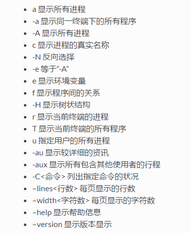
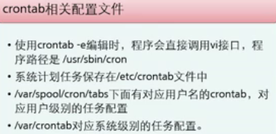
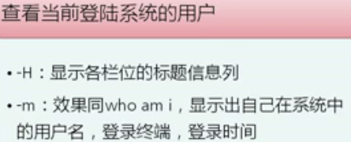

# 服务器定义及发展

## 服务器类型

```
运行更快、负载更高、价格更贵
提供计算或应用服务
通常通过网络提供服务
CPU发展遵循摩尔定律
```

> 按外形

- 塔式服务器
- 机架服务器
- 刀片式服务器
- 高密度服务器

> 按CPU数量

- 单路服务器
- 双路
- 多路：4颗CPU以上

> 按指令集（内核）

- 精简指令集RISC（非X86架构）
- 复杂指令集CISC（X86架构）

> 按应用

- 数据库服务器
- 文件服务器
- 应用服务器
- Web服务器
- 接入服务器

## 服务器硬件组成

### 核心组件

- CPU
- 内存
- 硬盘

### 基础硬件

- 主板

- 电源

- 风扇

- 机箱

- 网卡、PCIe卡、Raid卡等可选组件

  ```
  PCIe:电脑总线PCI的一种
  Raid卡：RAID卡一般分为硬RAID卡和软RAID卡两种，通过用硬件来实现RAID功能的就是硬RAID，独立的RAID卡，主板集成的RAID芯片都是硬RAID。通过软件并使用CPU的RAID卡是指使用CPU来完成RAID的常用计算，软件RAID占用CPU资源较高，绝大部分服务器设备是硬件RAID。
  ```

## 服务器技术和架构

### 技术架构的三大发展趋势

- Scale-up-纵向扩展架构
  ```
  1、提升单台服务器的计算性能
  2、适用于高性能业务场景
  ```

- Scale-out-横向扩展架构

  ```
  1. 高并发、低成本、高密度、节能低碳、统一管理等特点
  2. 适用于超大规模数据中心、大数据分析、公有云、Web应用集群等业务场景
  ```

- Hyper-converged-超融合架构
  ```
  1、在同一套单元设备（x86服务器）中不仅仅具备计算、网络、存储和服务器虚拟化等资源和技术，而且还包括缓存加速、重复数据删除、在线数据压缩、备份软件、快照技术等元素，而多节点可以通过网络聚合起来，实现模块化的无缝横向扩展（scale-out），形成统一的资源池。
  2、高速的整体融合、简单易用、性能优化
  3、适用于数据库整合、云计算资源池平台、一体化数据中心、高性能数据分析等场景
  ```

### 服务器部署模式

- 单机系统——工作站

- C/S

  

- B/S

  

### 服务器上层软件架构

- 操作系统/虚拟化——IaaS

- 数据库、中间件等——PaaS
  - 中间件为上层应用软件提供运行和开发环境，提供预制可复用的业务功能模块、API接口等

- 业务应用软件——SaaS

  ```
  基于数据库、中间件等基础架构平台之上，定制开发
  ```

## linux基础

### 概述

> unix和linux


>Linux结构

- 硬件

- 内核kernel

  ```
  Linux是一个一体化内核（monolithic kernel）系统。“内核”指的是一个提供硬件抽象层、磁盘及文件系统控制、多任务等功能的系统软件。一个内核不是一套完整的操作系统。一套基于Linux内核的完整操作系统叫作Linux操作系统，或是GNU/Linux。
  ```

- 外壳shell

  ```
  1. 用户和内核之间的命令解析器
  2. sh、csh、ksh
  ```

- 应用程序

> 特点

- 多任务

  ```
  CPU时间分片，分给不同的进程
  ```

- 多用户

  ```
  允许多个用户同时登陆使用
  ```

- 管道功能

  ```
  前一个程序的输出作为后一个程序的输入
  ```

- 强大的shell

  ```
  解释型高级语言
  ```

- 安全机制

  ```
  放置系统及其数据未经许可被非法访问
  ```

- 稳定性

  ```
  unix  > linux > windows
  ```

- 强大的网络支持

  ```
  linux与TCP/IP 完美结合
  ```

- 用户界面

- 移植性好

  ```
  内核由C语言编写，易于移植
  ```

### 用户和用户组

- UID

  > 用户ID信息文件：/etc/passwd

  ```
  /etc/passwd文件结构:
  用户名 ：密码 ：UID ：GID ：用户描述 ：用户家目录 ：用户shell类型（每一行代表一个账号，包含若干系统账号）

  注意：/etc/passwd不安全，/etc/shadow支持SHA-256和SHA-512密码哈希
  ```

  > SuperUser：UID=0

  > SystemUser：UID=1-499（系统账号）

  ```
  1~99：由distributions自行创建的系统账号
  100~499：若用户有系统账号需求时，可以使用的账号UID
  ```

  > 一般用户：UID = 500-65535

  > 管理本地用户

  ```
  1、创建用户
    useradd [-u UID] [-g 初始用户组] [-G 次要用户组] [-m/M] [-c 用户描述] [-d 用户家目录] [-s shell] Uname
     默认情况下不设置密码用户无法登陆
     [-s shell]缺省表示/bin/bash
     m:强制创建用户主文件夹（一般账号默认值）
     M：强制不创建用户主文件夹（系统账号默认值）
     缺省配置：/etc/default/useradd配置文件规定默认的初始用户组、shell等（useadd -D读取默认配置信息）
  2、删除用户
     userdel Uname：默认主目录保持不变
     userdel -r Unam ：一起删除用户主目录
  3、修改用户属性信息
  	usermod [-参数] Uname
  4、用户查询常命令
  	id：查询uid和gid
  	finger：查询当前用户属性信息
  5、设置用户密码
  	passwd
  ```

- GID

  > GID信息文件：/etc/group

  ```
  /etc/group文件结构：
  组名:组密码:GID:加入该组的用户

  1、新增用户组
  	groupadd [参数] [用户组名]
  		-g：指定新建工作组的id； 
  		-r：创建系统工作组，系统工作组的组ID小于500； 
  		-K：覆盖配置文件“/ect/login.defs”； 
  		-o：允许添加组ID号不唯一的工作组。
  2、groupdel [用户组名]
  	groupdel命令用于删除指定的工作组，本命令要修改的系统文件包括/ect/group和/ect/gshadow。若该群组中仍包括	  某些用户，则必须先删除这些用户后，方能删除群组。
  3、修改用户组：groupmod [参数][组名]
  	-g：修改组id
  	-n：修改组名
  ```

  > 没有SuperGroup

  > SystemGroup：GID = 0-499

  > 一般组：GID = 500-65535

### 文件和目录管理

- 目录结构

  

- 绝对路径 &  相对路径

- pwd [-P]

  ```
  显示当前路径
  -P:显示当前路径，而非连接（link）路径
  ```

- cd [ 目录 ]

  ```
  切换目录
  1、cd ~[用户名]：回到指定用户的主文件夹
  2、cd：回到当前用户的家目录
  3、cd ..：返回上层目录
  4、cd -
  ```

- mkdir

  ```
  mikdir [-mp] 目录名
  -p：建立目录时建立其所有不存在的父目录
  -m：配置权限
  ```

- rmdir：删除“空”的目录

  ```
  rmdir [-p] 目录名
  用于删除目录，要求对其父目录有写权限
  -p：连同上层“空”的目录一起删除，可删除多个目录
  ```

- cp：复制文件或者目录

  ```
  cp [-参数] source destination

  复制文件或目录，要求对其父目录有写权限
  ```

  

- mv：移动文件或者目录，或者更名

  ```
  mv [-参数] source destination

  移动文件或目录，要求对其父目录有写权限
  ```

  

- rm：移除文件或目录

  ```
  rm [-fir] 文件或目录

  删除文件或目录，要求对其父目录有写权限
  ```

  

- find

  ```
  find [路径][参数]

  参数：
  	查找文件：-name
  	查找用户：-user
  ```

  ​

- 文件内容查询

  - cat：直接查看文件内容，不能翻页
  - tac
  - nl（添加行号打印）

- 可翻译查看

  - head

    ```
    查看文档前面几行的内容，默认10行
    ```

  - tail

    ```
    查看文件最后几行内容，默认10行
    ```

  - more

    

  - less

    ```
    less [参数] 文件
    ```

    

- touch

  ```
  修改文件时间
  创建新文件
  ```

### 文件系统管理

- 概念

  > 操作系统用于明确存储和组织计算机数据的方法
  >
  > 文件和树形目录的抽象逻辑概念代替物理存储块

- 数据三要素

  - 文件名：定位存储位置
  - 数据
  - 元数据meta-date：文件有关的信息

- 历史


  ```
  windows 98以前主要的文件系统是FAT/FAT16（非索引）
  windows 2000之后主要是NTFS文件系统
  默认windows不会认识ext2文件系统
  ```

- 文件系统支持类型，可查看/etc/filesystems

- 文件系统分类

  > 是否日志文件

  - 传统型文件系统

    ```
    如：ext2文件系统，linux默认文件系统
    ```

  - 日志型文件系统

    ```
    如：ext3、ReiserFS
    ext3在ext2基础上加入日志功能
    ReiserFS基于平衡树，搜索快，节约空间
    ```

  > 是否有索引 
  -   索引式文件系统

      ```
      文件属性信息和实际内容存放在不同的区块
      inode + Block + super block
      【inode】：记录文件属性 + 数据所在block号
      【block】：实际文件内容
      【super block】：记录文件系统整体信息，inode/block总量、使用量、剩余量，文件系统的格式与相关信息
      ```

  - 非···

      ```
      只有Block，数据需要一个block一个block的读取
      如：windows下的FAT文件系统
      磁盘碎片整理:文件写入的block过于离散，读取性能低，此时需要磁盘碎片整理，将同一文件所属的block汇合在一起
      ```

- 配置文件系统分区

  ```
  【挂载】
  将文件系统与目录树结合的操作
  【挂载点】
  挂载点是目录，该目录是进入该文件系统的入口
  ```

  - 创建分区

    ```
    语法：fdisk [参数] 设备名
    -l：输出后面所接设备所有的分区内容
    -m：查看按键操作说明
    -n：新建分区
    -p：查看磁盘的相关信息
    步骤：1 选择分区类型
    	 2 选择分区开始的磁柱
    	 3 决定分区大小
    	 4 保存新建的分区
    	 5 重启服务器或partprobe命令通知内核
    ```

  - 磁盘格式化（创建文件系统）

    ```
    语法：mkfs [参数] 设备名
    参数说明：-t：指定文件系统格式
    		 -b：指定block大小
    分区完成后进行文件系统的格式化，mkfs是个综合的命令，会去调用正确的文件系统格式化工具软件
    ```

  - 磁盘检验

    ```
    fsck [-t 文件系统类型] [-ACay] 设备名
    ```

  - 挂载文件系统

    ```
    语法：mount [参数] 设备名 挂载点
    参数说明：-t：指定文件系统类型
    		 -b：指定block大小
    ```

- 管理Linux文件系统

  - 磁盘与目录的容量

    > df：列出文件系统的整体磁盘使用量

    ```
    df [参数] 目录或文件
    缺省参数：以1kb的容量显示出来
    -h：以容易阅读的GB等格式显示
    -m：以MB的容量显示各文件系统大小
    -i：不用硬盘容量，而用inode的数量来显示
    ```

    > du：评估文件系统的磁盘使用量

    ```
    du [参数] 目录或文件
    -a：显示目录下的每个文件所占的磁盘空间
    -s：只显示大小的总和
    -h：以容易阅读的GB等格式显示
    ```

  - 查看系统打开的文件

    ```
    lsof
    lsof filename：显示打开指定文件的所有进程
    lsof -c string：显示以指定字符开头的进程所有打开的文件
    lsof -u username：显示所属user相关进程打开的文件
    ```

  - 修复文件系统

    ```
    1、fsck
    检查并尝试修复文件系统错误
    执行fsck时，必须将要修复的设备进行umount后，再执行命令
    2、e2fsck
    检查和修复ext2和ext3文件系统
    ```


### LVM管理

- 什么是LVM？

  ```
  逻辑卷管理，LVM将一个或多个硬盘的分区在逻辑上集合，相当于一个大硬盘来使用，当硬盘的空间不够使用的时候，可以继续将其它的硬盘的分区加入其中，这样可以实现磁盘空间的动态管理，相对于普通的磁盘分区有很大的灵活性。
  ```

- LVM架构

  

  > 基本术语

  - LV

    ```
    以PE为单位进行划分
    PE是LVM的最小存储单
    与LE一一对应
    ```

  - VG

  - PV：物理卷，标记为LVM可用的空间，通常是分区类型0x8e标记。

  > LV、VG和PE的关系

  

  ```
  LVM通过交换PE的方式实现弹性变更磁盘的大小
  ```

  > 分区类型

  - 82：swap
  - 83：ext3/ext4
  - 8e：LVM分区
  - fd：RAID分区

- LVM优点

  ```
  1、文件系统可以跨越多个磁盘
  2、动态扩展文件系统大小
  3、便于增加新磁盘到LVM的存储池中
  ```

- 创建及管理逻辑卷

  > https://linux.cn/article-3218-1.html

  - 准备磁盘分区（LVM分区）

    

  - 创建PV

    ```
    pvcreate /dev/sdb1
    pvscan/pvdisplay：查看物理卷
    pvremove /dev/sdb1：删除物理卷
    ```

  - 创建卷组VG

    ```
    vgcreate VGname PV1 PV2···
    vgscan/vgdisplay：查看卷组
    vgremove VGname：删除卷组
    ```

  - 创建逻辑卷LV

    

> **创建好逻辑卷之后就可以进行格式化并挂载了**

- 管理文件系统空间

  > 增加文件系统空间——扩展逻辑卷的大小

  ```
  1、如果没有可用的卷组空间，则需要先扩展卷组
  ```

  

  ```
  2、扩展逻辑卷和文件系统,在扩展逻辑卷之前首先必须卸载该逻辑卷（umount）
  ```

  

  >缩小文件系统空间——缩小逻辑卷的大小

  ```
  在缩小逻辑卷之前首先必须卸载该逻辑卷（umount）
  ```
  

### 网络管理

- 查看网口配置

  ```
  语法：ifconfig [网卡]
  ```

- 修改网口的配置

  ```
  语法：ifconfig [网卡][:num][IP-Address][broadcast 广播地址][netmask 掩码]
  通过命令进行配置之后的配置信息保存在内存中，因此重启网络服务或操作系统后失效。
  保存配置信息，以避免重启网络服务或操作系统后失效。
  	1、编辑配置文件配置网口：vi /etc/sysconfig/network/ifcfg-[网口]
  	2、启动网口,使配置生效：ifup /etc/sysconfig/network/ifcfg-[网口]
  ```
  ```
  禁用网卡：ifconfig [网卡] down
  启用网卡：ifconfig [网卡] up
  ```

  

- 增加路由项目

  ```
  语法：route add [-net|-host][目标ip地址] [netmask 掩码][gw 下一跳地址]
  route配置并查看内核路由表的配置情况
  在root下执行
  重启系统失效——修改配置文件/etc/sysconfig/network/routes
  	1、该文件用来保存静态路由数据
  	2、需重启生效
  ```
  

- 侦测网络

  >ping [参数]目的地址

  

  ```
  1. 使用ipconfig /all观察本地网络设置是否正确
  2. Ping 127.0.0.1检查本地的TCP/IP协议有没有设置好;
  3. Ping本机IP地址，这样是为了检查本机的IP地址是否设置有误;
  4. Ping本网网关或本网IP地址，这样的是为了检查硬件设备是否有问题，也可以检查本机与本地网络连接是否正常;
  5. Ping远程IP地址，这主要是检查本网或本机与外部的连接是否正常。
  ```

  > traceroute <地址 or 主机名>

  ```
  使用到的协议：ICMP网间控制报文协议
  ```

- 配置常用网络服务

  > 配置FTP服务

  

  > 配置Telnet服务

  

### 进程和任务管理

- 进程管理

  > 相关概念

  

  ```
  1、进程是程序的一个具体实现，即进程是执行程序的过程
  2、PID唯一标识进程
  3、linux上进程有5种状态:
  	a.运行(正在运行或在运行队列中等待)
  	b.中断(休眠中, 受阻, 在等待某个条件的形成或接受到信号)
  	c.不可中断(收到信号不唤醒和不可运行, 进程必须等待直到有中断发生)
  	d.僵死(进程已终止, 但进程描述符存在, 直到父进程调用wait4()系统调用后释放)
  	e.停止(进程收到SIGSTOP, SIGTSTP, SIGTTIN, SIGTTOU信号后停止运行运行)
  ```

  > 查看进程

  - ps：监视进程工具，查看某一时间点进程信息

    

  - top：连续观察进程动态

    ```
    默认每3秒刷新一次
    按照CPU使用率由高到低排序
    ```

  - pstree：用ASCII字符 显示树状结构


    ```
    -p：显示进程ID
    -u：显示用户名
    ```

> 结束进程


- 任务管理

  

  > 相关命令

  

  

  

> 管理周期计划任务




> 管理定时任务


### 系统监控

- 监控系统是否正常运行

  ```
  dmesg | less：查看存储在kernel ring buffer中的系统启动信息
  /var/log/boot.msg：保存启动信息
  ```

- 系统的硬件信息

  

  

  

  

  

  ​

- 监控系统和进程

  

- 监控用户登录信息

  ```
  who
  ```

  

  ```
  w [参数][用户]
  比who详细
  ```

  

  ​

  ```
  finger [参数][用户]：查看用户详细信息
  -s：短格式显示用户信息
  -l：长···
  ```

  ```
  last [参数]：查看曾经登陆过系统的用户
  -n num：设置显示名单的显示列数
  -f：显示登陆和登出的详细信息
  ```

  ```
  lastlog [参数][用户]：查看用户前一次登陆的信息
  -t days：查看距今天n天内登陆系统的用户的最近一次登陆信息
  -u：显示登陆和登出的详细信息
  ```

  ​

  ​

  ​

